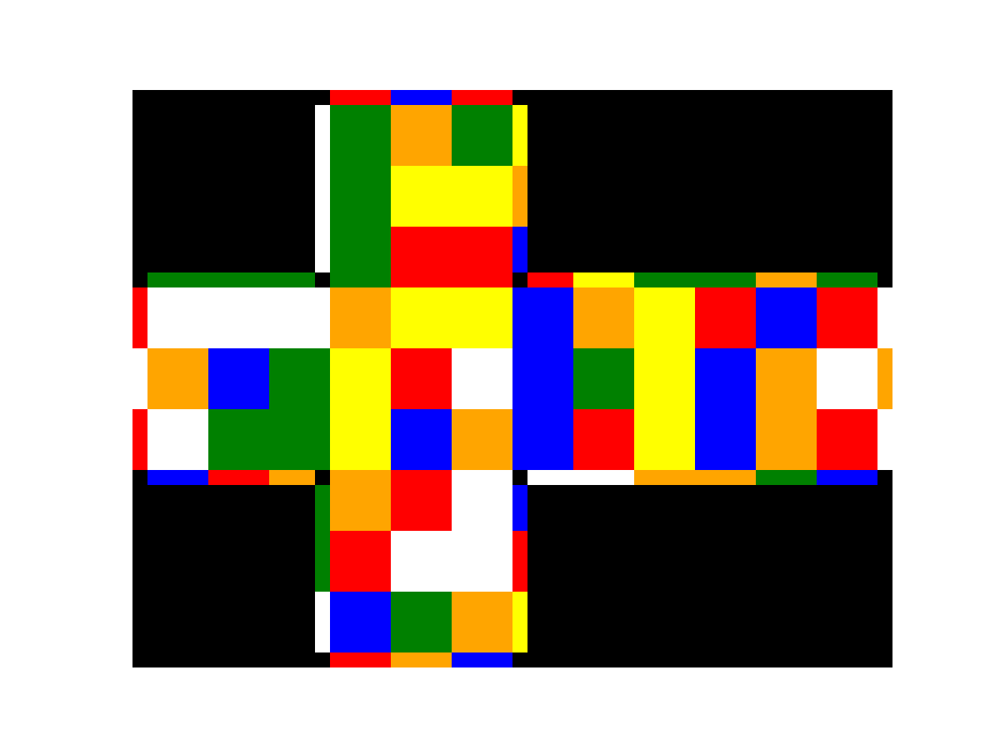

# Rubik's Cube Blindsolving Memo Trainer



This is a simple virtual cube which is solved by inputting blindsolving letter pairs, rather than face turns.

Why make this: I want to practice memorizing scrambles, since I have some practice with memory sports, but I do not know the algorithms for OP (or any other method). Because I struggle with the notation, if I attempted to solve the cube blindfolded I would have no idea if I messed up memorization or execution (since my eyes would be closed).

## Usage

```
python3 main.py
```

## TODO

- add user input
- add timer
- add a bunch of features